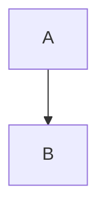

# Контрольні запитання до Лабораторної роботи №3

### 1. Що таке Markdown і для чого він використовується?
**Markdown** — це полегшена мова розмітки тексту, створена для написання максимально читабельного і зручного для правки тексту, який можна перетворити в HTML (та інші формати).
**Використовується для:** написання документації (`README.md`), повідомлень на форумах, технічних блогів та книг.

### 2. Які основні елементи форматування підтримує Markdown?
Основні елементи включають:
* **Заголовки** (`#`, `##`, `###`)
* **Списки** (маркіровані `*`, `-` та нумеровані `1.`)
* **Виділення тексту** (**жирний**, *курсив*)
* **Посилання** `[текст](url)` та **зображення** ``
* **Цитати** (`>`)
* **Код** (блочний \`\`\` та інлайн \`)

### 3. Як у Markdown вставляються формули LaTeX?
* **Інлайн** (всередині рядка): Використовується один символ долара. Наприклад: `$E=mc^2$`.
* **Блочні** (окремий абзац): Використовуються подвійні символи долара. Наприклад:
  $$\sum_{i=0}^n i^2$$

### 4. Що таке Mermaid і як додати просту діаграму у Markdown?
**Mermaid** — це інструмент на основі JavaScript для генерації діаграм і графіків з тексту. Щоб додати діаграму, використовується блок коду з вказівкою мови `mermaid`.

Приклад коду:

5.	Як виконати конвертацію Markdown у формати HTML, DOCX і PDF за допомогою Pandoc? 
Використовується команда у форматі: pandoc input.md -o output.format.
•	HTML: pandoc file.md -o file.html
•	DOCX: pandoc file.md -o file.docx
•	PDF: pandoc file.md -o file.pdf

6.	Яка структура типового проєкту Markdown на GitHub? 
Типова структура включає:
•	README.md (опис проєкту в корені).
•	docs/ (папка з документацією).
•	src/ або dist/ (вихідний код або згенеровані файли).
•	LICENSE (файл ліцензії).
•	.gitignore (файл виключень для Git).

7.	Як налаштувати GitHub Pages для публікації HTML-файлу? 
Необхідно зайти в налаштування репозиторію (Settings) -> розділ "Pages". У пункті "Build and deployment" -> "Source" обрати "Deploy from a branch". Далі вибрати гілку (наприклад, main або gh-pages) і папку (наприклад, /docs), після чого зберегти зміни.

8.	У чому переваги зберігання документації у Markdown перед традиційними текстовими форматами?
•	Читабельність: Текст зрозумілий навіть у вихідному коді.
•	Контроль версій: Оскільки це звичайний текст, Git ідеально відстежує зміни (diffs), на відміну від бінарних файлів .docx.
•	Універсальність: Легко конвертується в будь-який інший формат.

9.	Які проблеми можуть виникати при конвертації у PDF і як їх вирішити? 
Основна проблема — відсутність встановленого LaTeX-движка (наприклад, MiKTeX або TeX Live) або проблеми зі шрифтами (не відображається кирилиця).
Рішення: Встановити LaTeX або використати інший движок через аргумент --pdf-engine=wkhtmltopdf. Для шрифтів — вказати шрифт, що підтримує кирилицю, у налаштуваннях Pandoc.

10.	Які вимоги до оформлення звіту згідно цієї лабораторної роботи?
Звіт має бути у папці docs/, містити заголовок, опис, список 5 книг, мінімум 3 формули LaTeX, діаграму Mermaid, таблицю та висновки. Також мають бути згенеровані файли у папці dist/ .

