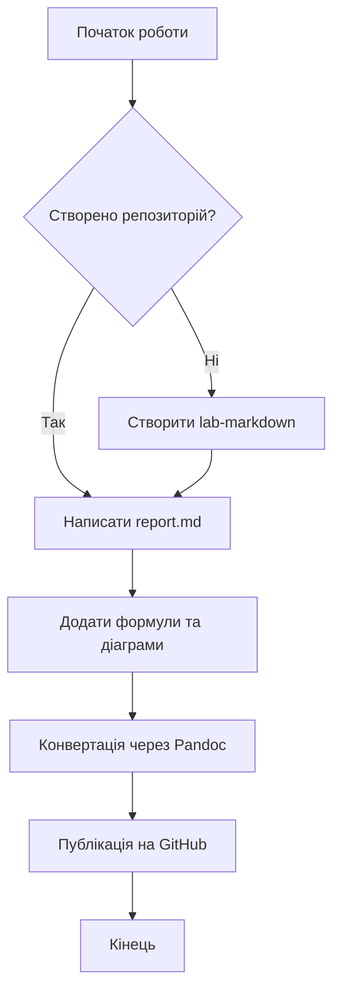

# Звіт до Лабораторної роботи №3
**Тема:** Markdown та публікація на GitHub

## Опис
У цій лабораторній роботі я досліджую можливості мови розмітки Markdown для створення структурованої документації. Ми навчимося інтегрувати математичні формули, будувати діаграми за допомогою Mermaid та конвертувати документи у різні формати. Цей звіт демонструє практичне застосування цих навичок на реальному прикладі.

## Мої улюблені книги
Ось список з 5 книг, які справили на мене найбільше враження:

1.  **"Енеїда"** — Іван Котляревський
2.  **"Конотопська відьма"** — Григорій Квітка-Основ'яненко
3.  **"Кобзар"** — Тарас Шевченко
4.  **"Лісова пісня"** — Леся Українка
5.  **"Маруся Чурай"** — Ліна Костенко 

## Математичні формули
Нижче наведено приклади математичних виразів, оформлених за допомогою LaTeX.

**Інлайн формула:**
Найвідоміша формула у світі фізики — це $E = mc^2$, що описує еквівалентність маси та енергії.

**Блочні формули:**

Рівняння коренів квадратного рівняння:
$$x = \frac{-b \pm \sqrt{b^2 - 4ac}}{2a}$$

Теорема Піфагора:
$$a^2 + b^2 = c^2$$

Ряд Тейлора для експоненти:
$$e^x = \sum_{n=0}^{\infty} \frac{x^n}{n!} = 1 + x + \frac{x^2}{2!} + \frac{x^3}{3!} + \cdots$$

## Діаграма Mermaid
Схема процесу виконання лабораторної роботи:

## Таблиця книг
Перелік книг із зазначенням орієнтовної кількості сторінок:

| Назва книги | Автор | Кількість сторінок |
| :--- | :--- | :---: |
| Енеїда | Іван Котляревський | 320 |
| Конотопська відьма | Г. Квітка-Основ'яненко | 160 |
| Кобзар | Тарас Шевченко | 720 |
| Лісова пісня | Леся Українка | 144 |
| Маруся Чурай | Ліна Костенко | 192 |

## Висновки
У ході виконання цієї роботи я опанувала синтаксис Markdown, навчилася вбудовувати складні елементи, такі як формули LaTeX та графіки Mermaid. Використання Pandoc дозволило автоматизувати процес створення документації у професійних форматах (PDF, DOCX). Це значно спрощує ведення технічної документації та її версіонування через Git.